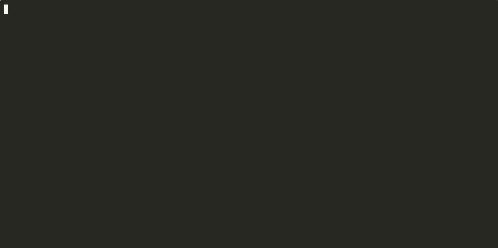

# /ship: a ticket pipeline that runs while you're away

`/ship` takes a Jira ticket through **pickup → plan → implement → draft PR → QA → post-merge monitoring → close**. An unattended loop does the work in a tmux window; you approve every step that leaves your machine from a second window. Each ticket's progress lives in one markdown file, so any session (or a fresh one after a crash) can pick it up exactly where it stopped.



*The `ship-state` and guard output in the demo is real, run against the made-up tickets in [`examples/ship-demo/`](../examples/ship-demo/). The Claude session in the middle is a scripted replay. Rebuild it with [`examples/ship-demo.sh`](../examples/ship-demo.sh).*

## What it never does alone

Commit, push, open or edit PRs, write to Jira, or open a database shell. In the loop window a hook (`hooks/ship_guard.py`, called from `bash-safety.sh` when `SHIP_UNATTENDED=1`) denies those commands, and the ticket **parks** at a gate instead. The tmux status bar shows `ship:N waiting` until you clear it with `/ship`. Reviewing and merging always stay with you.

| Gate | You see | You choose |
|---|---|---|
| `plan-approval` | the plan and the monitoring spec | loop implements · I'll drive · revise · drop |
| `publish` | diff stat, commit message, PR title + body, QA results | commit + push + draft PR · commit only · revise |
| `push` | the CI fix | push · revise |
| `qa-failed` | the failing check and a proposed fix | fix · accept with a reason · drop |
| `jira-write` | every queued comment and status change | post all · edit · drop |
| `close` | outcome summary after monitoring | close · keep monitoring |

## Set up

1. Run `./install.sh`. It links `ship-state`, `ship-up`, `ship-down`, `ship-loop`, `ship-qa`, `ship-media` and `ship-jira` into `~/.local/bin`.
2. Jira: the loop's shell scripts can't call an MCP server, so set `JIRA_HOST` (e.g. `yourteam.atlassian.net`), `JIRA_EMAIL` and `JIRA_API_TOKEN` in `~/.zshenv` (or `~/.bashrc` above its interactive-only guard on Linux).
3. Optional for QA: `ship-qa setup` installs Playwright and headless Chromium in your home folder. Per repo, set `SHIP_QA_PREVIEW_<SHORTNAME>` (a URL with `{pr}` in it) and `SHIP_QA_BASE_<SHORTNAME>`, plus `SHIP_QA_ALLOWED_HOSTS` (a regex of the hosts checks may visit).
4. Optional for monitoring: `SENTRY_ORG` and a Sentry token, `POSTHOG_HOST` + `POSTHOG_PROJECT_ID` + `POSTHOG_PERSONAL_API_KEY`, and `SHIP_SQL` pointing at a script that runs one query against a **read-only** source.
5. `cp templates/tmux.conf ~/.tmux.conf` for the status bar and Option-1/Option-2 window switching.

It runs on macOS or Linux. On an always-on box it keeps working while your laptop sleeps; there, run `ship-media` on your laptop with `SHIP_REMOTE=user@box` to fetch QA videos.

## Run it

```bash
ship-up          # tmux session "ship": window 1 = the loop, window 2 = you
```

| In the `work` window | To |
|---|---|
| `/ship` | see what changed since you last looked, and clear what's waiting |
| `/ship API-42` | start a ticket, or resume one that's parked |
| `/ship API-42 abandon` | drop a ticket |
| `/monitor API-42` | run a merged ticket's production checks now |

Give the loop work by adding the `claude-ready` label to a ticket assigned to you in **To Do**; it picks up at most two per tick. `ship-down` stops Claude in both windows (tickets stay on disk), and `ship-loop status` tells you whether the loop is really running.

## How a ticket moves

- **pickup**: reads the ticket, routes it to repos with `/start`'s routing rules, and asks questions if there are no acceptance criteria.
- **plan**: writes the plan, a QA plan, and a **monitoring spec**: what "broken in production" would look like for this change.
- **implement**: in a git worktree, never your checkout. Code, tests, the repo's own checks, then QA on localhost.
- **pr**: after you approve publish, watches CI, re-runs QA on each new commit against the PR preview, and records before/after videos.
- **monitor**: after merge, runs the monitoring spec every 6 hours for 7 days, against a baseline from before the merge. A regression queues a Jira comment for you to approve.
- **close**: removes the worktree and archives the state file.

The skill files are in [`.claude/skills/ship/`](../.claude/skills/ship/) (`SKILL.md`, `stages.md`, `qa.md`) and [`.claude/skills/monitor/`](../.claude/skills/monitor/). Problems the pipeline hits with its own instructions are logged to `~/.claude/work/issues.log`, so you can fix the skills rather than the symptoms.

## Tests

```bash
python3 -m unittest tests/test_ship_guard.py
bash tests/ship-state.test.sh
```
